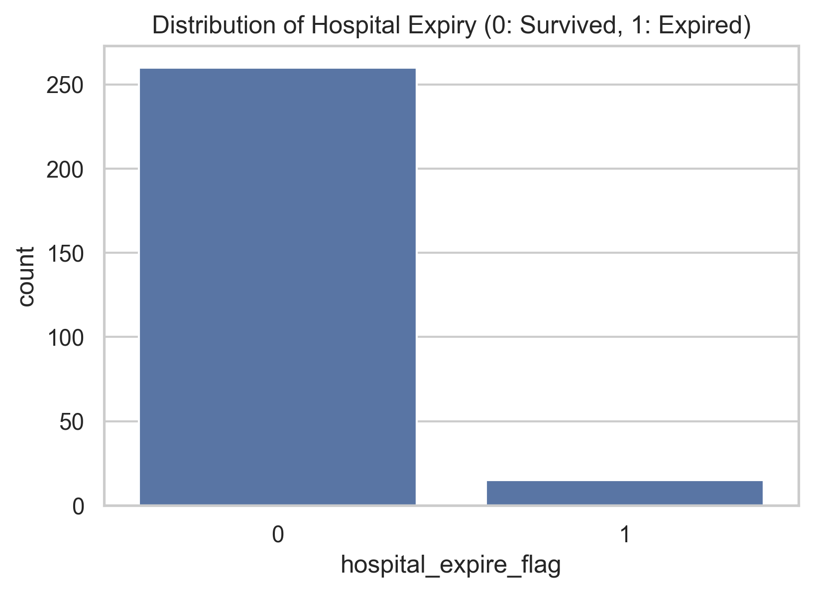
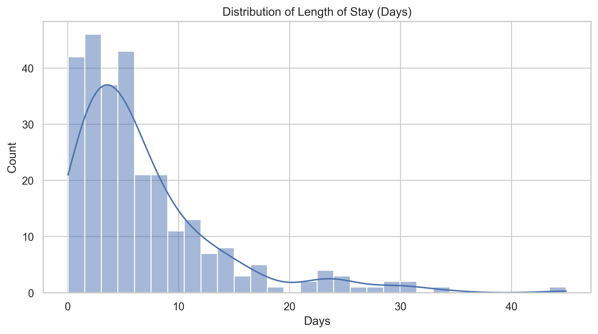
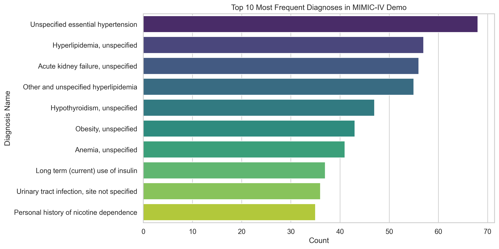
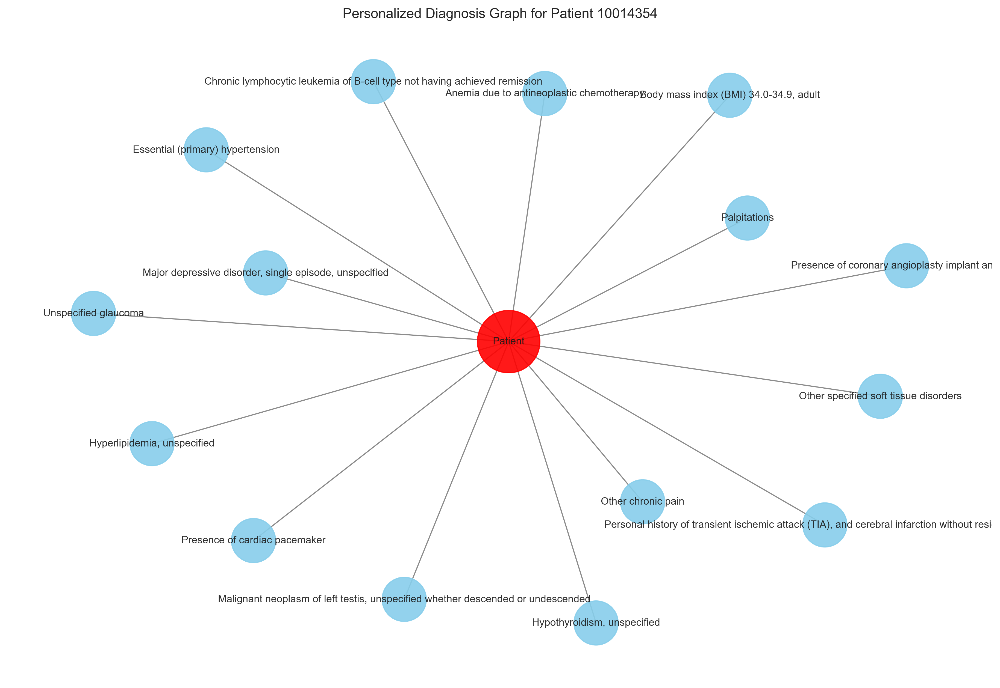
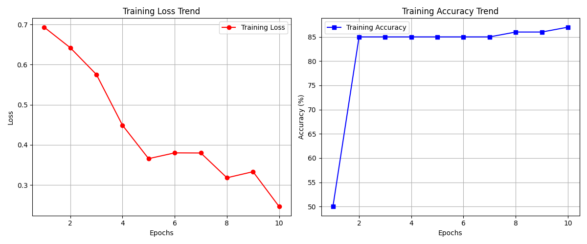

# MIMIC-IV Clinical Data Analysis & Prediction

## 🏥 Project Overview
이 프로젝트는 **MIMIC-IV Demo (v2.2)** 데이터를 활용하여 중환자실(ICU) 환자의 임상 데이터를 분석하고, 주요 헬스케어 지표를 예측하는 모델을 구축하기 위한 연구 베이스라인입니다.

**GraphCare** 논문 등 최신 의료 AI 연구에서 주로 다루는 4가지 핵심 태스크를 위한 데이터 전처리(Preprocessing) 및 탐색적 데이터 분석(EDA)을 포함합니다.

## 🎯 Key Objectives
1.  **Data Understanding:** 복잡한 EHR(Electronic Health Records) 데이터 구조 파악 및 테이블 간 관계 분석
2.  **EDA (Exploratory Data Analysis):**
    * 재원 기간 (Length of Stay, LOS) 분포 확인
    * 원내 사망률 (Mortality Rate) 분석
    * 주요 진단 코드 (ICD Codes) 빈도 분석
3.  **Preprocessing:** 시계열 데이터 정제 및 환자별 `Visit-level` 데이터 구축
4.  **Prediction (Future Work):** 사망률, 재입원, 재원 기간, 약물 추천 예측 모델 구현

## 📂 Dataset
본 프로젝트는 [PhysioNet](https://physionet.org/content/mimic-iv-demo/2.2/)의 MIMIC-IV Clinical Database Demo (v2.2)를 사용합니다.
* **Subjects:** 100명의 중환자 샘플 데이터
* **Modules:** `hosp` (병원 일반 기록), `icu` (중환자실 기록)
* *Note: MIMIC-IV 데이터 사용 승인을 준수하며, 원본 데이터 파일은 저장소에 포함되지 않습니다.*

## 🛠 Tech Stack
* **Language:** Python 3.9+
* **Data Manipulation:** Pandas, NumPy
* **Visualization:** Matplotlib, Seaborn
* **Environment:** Jupyter Notebook

## 📊 Analysis Summary (EDA)
### 🏥 1차 EDA 결과: 환자 및 입원 현황 분석 (Updated)
* **데이터셋:** MIMIC-IV Demo v2.2 (hosp module)
* **분석 대상:** `patients` (환자 정보) + `admissions` (입원 기록)

#### 1. 기본 통계 (Statistics)
* **총 환자 수 (Unique Subjects):** 100명
* **총 입원 건수 (Total Admissions):** 275건
* **평균 입원 횟수:** 환자당 약 2.75회

#### 2. 핵심 지표 (Key Metrics)
| 지표 (Metric) | 결과 값 (Result) | 비고 |
| :--- | :--- | :--- |
| **원내 사망률 (Mortality Rate)** | **5.45%** (15/275건) | 전체 입원 건수 대비 사망 비율 |
| **평균 재원 기간 (Avg LOS)** | **약 9.1일** | 퇴원일(`dischtime`) - 입원일(`admittime`) |
| **성별 분포** | F (여성), M (남성) | *Notebook 내 그래프 참조* |

#### 3. 발견점 (Insights)
* **재원 기간(LOS) 분포:** 대부분의 환자가 단기 입원(0~10일)에 집중되어 있으나, 일부 장기 입원 환자가 존재하여 분포가 오른쪽으로 긴 꼬리(Long-tail) 형태를 띔.
* **사망률:** 데모 데이터의 사망률은 약 5.5%로, 중환자실(ICU) 데이터가 포함된 MIMIC 데이터셋의 특성을 반영함.

### 4. 시각화 결과 (Visualization Results)
| 원내 사망률 분포 (Mortality Distribution) | 재원 기간 분포 (LOS Distribution) |
| :---: | :---: |
|  |  |
| *생존(0) vs 사망(1) 환자 수 비교* | *환자들의 입원 기간(일) 분포* |

### 🧬 2차 EDA 결과: 진단 분석 및 환자 그래프 (Diagnosis & Patient Graph)
* **분석 대상:** `diagnoses_icd` (진단 기록) + `d_icd_diagnoses` (코드 사전)

#### 1. 주요 질병 분포 (Top Diagnoses)
* MIMIC-IV 데모 데이터에서 가장 빈번하게 발생하는 질병 상위 10개를 분석했습니다.
* **발견점:** 고혈압(Hypertension), 지질대사 장애(Disorders of lipoid metabolism) 등이 상위권을 차지합니다.

#### 2. 환자 개인화 그래프 (Personalized Patient Graph)
* **GraphCare 논문 구현의 기초:** 특정 환자(Node P)와 그가 진단받은 질병들(Medical Concepts)을 엣지로 연결하여 네트워크를 시각화했습니다.
* **구조:** `Patient (Red)` ↔ `Diseases (Blue)`

| 상위 10개 진단명 (Top 10 Diagnoses) | 환자 맞춤형 질병 그래프 (Patient Graph) |
| :---: | :---: |
|  |  |
| *가장 흔한 질병 상위 10개 분포* | *환자 ID 10014354의 질병 네트워크* |

### 🧹 3차 전처리 결과 (Data Preprocessing)
* **목표:** 원본 CSV 데이터를 AI 모델(RNN, GNN 등)이 학습할 수 있는 **시퀀스(Sequence) 형태**로 변환
* **통합 데이터:** `Conditions` (진단) + `Procedures` (시술) + `Drugs` (약물)
* **결과물:** `data/processed_data.pkl` (Python Pickle Format)

#### 1. 데이터 통계 (Statistics)
| 구분 (Category) | 고유 코드 수 (Vocab Size) | 설명 |
| :--- | :--- | :--- |
| **진단 (Conditions)** | **1,472**개 | ICD 진단 코드 매핑 완료 |
| **시술 (Procedures)** | **352**개 | 수술 및 처치 코드 매핑 완료 |
| **약물 (Drugs)** | **631**개 | 처방 약물 이름 매핑 완료 |
| **총 환자 수** | **100**명 | 환자별 시계열 방문 기록 구축 완료 |

#### 2. 데이터 구조 (Data Structure)
전처리된 데이터는 환자의 방문 이력을 시간 순서대로 정렬하여 다음과 같은 계층 구조를 가집니다.
(예시: 환자 ID `10000032`의 첫 번째 방문 기록)

```python
{
    10000032: [
        # 첫 번째 방문 (Visit 1)
        {
            'hadm_id': 22259585,
            'admittime': '2180-05-06 22:23:00',
            'conditions': [0, 1, 2, 3, 4, 5, 6, 7],  # 8개 진단
            'procedures': [10],                      # 1개 시술
            'drugs': [5, 22, 1, 8, ...]              # 14개 약물
        },
        # 두 번째 방문 (Visit 2) ...
    ]
}
```
### 🧱 4단계: PyTorch 데이터셋 파이프라인 (Dataset & DataLoader)
* **목표:** 전처리된 데이터를 딥러닝 모델(RNN, GraphCare 등)의 입력에 맞는 **Tensor 형태**로 변환
* **핵심 구현:** `MIMICDataset` 클래스 및 `collate_fn` (Batch Processing)

#### 1. 데이터 변환 전략 (Transformation Strategy)
* **Multi-hot Encoding:** 한 번의 방문에 여러 개의 진단/시술/약물이 존재할 수 있으므로, 해당 코드의 인덱스 위치를 `1`로 마킹하는 방식을 사용했습니다.
* **Padding & Masking:** 환자마다 방문 횟수(Sequence Length)가 다르므로, 배치 내 최대 길이에 맞춰 `0`으로 패딩(Padding)하고, 유효한 데이터 구간을 알려주는 `Mask`를 생성했습니다.

#### 2. 최종 텐서 형태 (Input Tensor Shapes)
모델 학습 시 `DataLoader`가 반환하는 텐서의 차원(Dimension)입니다.
* **Notation:** `B`=Batch Size, `T`=Max Sequence Length (Visits), `V`=Vocab Size

| 입력 텐서 (Tensor Name) | 형태 (Shape) | 설명 |
| :--- | :--- | :--- |
| **Diagnosis** | `(B, T, 1,472)` | 진단 코드 입력 (Multi-hot) |
| **Procedures** | `(B, T, 352)` | 시술 코드 입력 (Multi-hot) |
| **Medications** | `(B, T, 631)` | 약물 코드 입력 (Multi-hot) |
| **Mask** | `(B, T)` | 1: 실제 방문 / 0: 패딩 |

### 🧠 5단계: 베이스라인 모델 학습 (Baseline Model: GRU)
* **목표:** 시계열(Time-series) 의료 데이터를 처리하기 위해 **GRU(Gated Recurrent Unit)** 모델을 구축하고 사망률 예측 성능 검증
* **입력 데이터:** 진단(Diagnosis), 시술(Procedure), 약물(Medication) 임베딩 벡터의 연결(Concatenation)
* **학습 설정:** Epochs: 10, Batch Size: 16, Learning Rate: 0.001, Optimizer: Adam

#### 1. 학습 결과 요약 (Training Results)
10 Epoch 학습 결과, Loss가 안정적으로 감소하며 모델이 정상적으로 패턴을 학습함을 확인했습니다.

| 구분 (Metric) | 초기값 (Epoch 1) | 최종값 (Epoch 10) | 비고 |
| :--- | :---: | :---: | :--- |
| **Loss** | 0.6566 | **0.2512** | 📉 61% 감소 (안정적 수렴) |
| **Accuracy** | 85.00% | **87.00%** | 📈 사망 위험 환자 구분 시작 |

#### 2. 학습 곡선 (Learning Curve)

* *좌측: 학습 손실(Loss) 감소 추이 / 우측: 정확도(Accuracy) 상승 추이*

## 📂 Project Structure
```bash
├── .venv/                  # Python 가상환경 (Git 업로드 제외됨)
├── data/                   # MIMIC-IV 데이터 폴더 (Git 업로드 제외됨)
│   ├── processed_data.pkl  # 전처리 완료된 데이터
│   ├── ehr_gru_model.pth   # [New] 학습된 GRU 모델 가중치 파일
│   ├── hosp/               # 병원 일반 기록 (patients.csv 등)
│   ├── icu/                # 중환자실 기록 (icustays.csv 등)
│   └── processed_data.pkl  # [New] 전처리 완료된 통합 데이터 (AI 모델 입력용)
├── images/                 # README 및 분석 결과 그래프 저장소
│   ├── training_result_gru.png # [New] 학습 Loss/Acc 곡선 그래프
│   ├── mortality_rate.png
│   ├── patient_graph_sample.png
│   └── ...
├── notebooks/              # 데이터 분석용 Jupyter Notebooks
│   ├── 01_basic_eda.ipynb          # 기초 EDA: 데이터 로드 및 분포 확인
│   ├── 02_diagnosis_analysis.ipynb # 심화 EDA: 진단 코드 분석 및 환자 그래프
│   ├── 03_preprocessing.ipynb      # [New] 데이터 전처리: 시퀀스 생성 및 매핑
│   ├── 04_pytorch_dataset.ipynb    # [New] 모델링 준비: PyTorch Dataset 구축
│   └── 05_model_training.ipynb # [New] 모델 학습: GRU Baseline 구현 및 학습
├── .gitignore              # 데이터 및 가상환경 업로드 방지 설정
└── README.md               # 프로젝트 가이드 문서
```